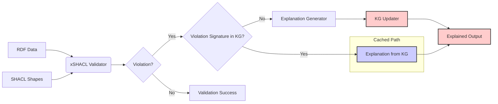

# xSHACL: Explainable SHACL Validation

## Overview

xSHACL is an explainable SHACL validation system designed to provide human-friendly, actionable explanations for SHACL constraint violations. Traditional SHACL validation engines often produce terse validation reports, making it difficult for users to understand why a violation occurred and how to fix it. This system addresses this issue by combining rule-based justification trees with retrieval-augmented generation (RAG) and large language models (LLMs) to produce detailed and understandable explanations.

A key feature of xSHACL is its use of a **Violation Knowledge Graph (KG)**. This persistent graph stores previously encountered SHACL violation signatures along with their corresponding natural language explanations and correction suggestions. This caching mechanism enables xSHACL to efficiently reuse previously generated explanations, significantly improving performance and consistency.

**Disclaimer:** xSHACL is an independent project and is **not affiliated with or related to any existing projects or initiatives using the name "SHACL-X" or similar variants.** Any perceived similarities are purely coincidental.

## Architecture



## Features

* **Explainable SHACL Validation:** Captures detailed information about constraint violations beyond standard validation reports.
* **Justification Tree Construction:** Builds logical justification trees to explain the reasoning behind each violation.
* **Restrictions KG:** Generates a restriction Knowledge Graph, caching similar violations and their natural language explanations / correction suggestions.
* **Context Retrieval (RAG):** Retrieves relevant domain knowledge, including ontology fragments and shape documentation, to enrich explanations.
* **Natural Language Generation (LLM):** Generates human-readable explanations and correction suggestions using large language models.
* **Support to multiple LLMs:** To the moment, OpenAI, Google Gemini, and Anthropic's Claude models are supported via API. Any other models with API following the OpenAI standard can be quickly and easily extended.
* **Ollama Integration:** Enables local LLM usage for enhanced privacy and performance.
* **Simple Interface:** Provides an easy-to-use interface to validate and explain RDF data.
* **Generalizability:** The underlying methodology is adaptable to other constraint languages.

## Getting Started

### Prerequisites

* Python 3.7+
* API Keys for LLMs (OpenAI, Google, or Anthropic)
* Ollama (optional, for local LLM usage)

### Installation

1.  Clone the repository:

    ```bash
    git clone <repository_url>
    cd xshacl
    ```

2.  Create a virtual environment (recommended):

    ```bash
    python3 -m venv .venv
    source .venv/bin/activate  # On macOS and Linux
    .venv\Scripts\activate     # On Windows
    ```

3.  Install the required dependencies:

    ```bash
    pip install -r requirements.txt
    ```

4.  Add a `.env` file to the root folder containing your API keys (this won't be committed to any repo):

    ```bash
    OPENAI_API_KEY=xxxxxxxxx
    GEMINI_API_KEY=xxxxxxxxx
    ANTHROPIC_API_KEY=xxxxxxxxx
    ```

5.  (Optional, for running locally) Install and run Ollama, and pull a model (e.g., `gemma:2b`):

    ```bash
    ollama pull gemma:2b
    ```
    PS: `gemma:2b` is recommended due to its speed, but `llama3.3` could be used for better quality or even `deepseek-r1` for more complex shapes.

### Usage

1.  Place your RDF data and SHACL shapes files in the `data/` directory.

2.  Run the `main.py` script with your parameters, e.g.:

    ```bash
    python src/main.py --data data/example_data.ttl --shapes data/example_shapes.ttl --model=gpt-4o-mini-2024-07-18
    ```

    or to run with Ollama:

    ```bash
    python src/main.py --data data/example_data.ttl --shapes data/example_shapes.ttl --local
    ```

3.  The system will validate the RDF data and output detailed explanations for any violations in JSON format.

### Example

```json
{
  "violation": {
    "focus_node": "[http://example.org/resource/1](https://www.google.com/search?q=http://example.org/resource/1)",
    "shape_id": "[http://example.org/shapes#PersonShape](https://www.google.com/search?q=http://example.org/shapes%23PersonShape)",
    "constraint_id": "[http://www.w3.org/ns/shacl#MinCountConstraintComponent](https://www.google.com/search?q=http://www.w3.org/ns/shacl%23MinCountConstraintComponent)",
    "violation_type": "CARDINALITY",
    "property_path": "[http://example.org/property/hasName](https://www.google.com/search?q=http://example.org/property/hasName)",
    "value": null,
    "message": "Minimum cardinality 1 not met.",
    "severity": "Violation"
  },
  "justification_tree": {
    "violation": {
      "focus_node": "[http://example.org/resource/1](https://www.google.com/search?q=http://example.org/resource/1)",
      "shape_id": "[http://example.org/shapes#PersonShape](https://www.google.com/search?q=http://example.org/shapes%23PersonShape)",
      "constraint_id": "[http://www.w3.org/ns/shacl#MinCountConstraintComponent](https://www.google.com/search?q=http://www.w3.org/ns/shacl%23MinCountConstraintComponent)",
      "violation_type": "CARDINALITY",
      "property_path": "[http://example.org/property/hasName](https://www.google.com/search?q=http://example.org/property/hasName)",
      "value": null,
      "message": "Minimum cardinality 1 not met.",
      "severity": "Violation"
    },
    "justification": {
      "statement": "The node [http://example.org/resource/1](https://www.google.com/search?q=http://example.org/resource/1) must have at least 1 value for the property [http://example.org/property/hasName](https://www.google.com/search?q=http://example.org/property/hasName).",
      "type": "conclusion",
      "evidence": null,
      "children": []
    }
  },
  "retrieved_context": {
    "ontology_fragments": [
      "[http://example.org/resource/1](https://www.google.com/search?q=http://example.org/resource/1) [http://example.org/property/hasAge](https://www.google.com/search?q=http://example.org/property/hasAge) \"30\"^^[http://www.w3.org/2001/XMLSchema#integer](https://www.google.com/search?q=http://www.w3.org/2001/XMLSchema%23integer) ."
    ],
    "shape_documentation": [
      "This shape describes a Person."
    ],
    "similar_cases": [],
    "domain_rules": []
  },
  "natural_language_explanation": "The resource [http://example.org/resource/1](https://www.google.com/search?q=http://example.org/resource/1) is missing a name. It should have at least one name.",
  "correction_suggestions": [
    "Ensure the property has at least 1 values."
  ]
}
```

## Project Structure

```
xshacl/
├── data/
│   ├── example_data.ttl
│   ├── example_shapes.ttl
|   └── xshacl_ontology.ttl
├── logs/
│   └── xshacl.log
├── src/
│   ├── __init__.py
│   ├── xshacl_architecture.py
│   ├── extended_shacl_validator.py
│   ├── justification_tree_builder.py
│   ├── context_retriever.py
│   ├── explanation_generator.py
│   └── main.py
├── tests/
│   ├── __init__.py
│   ├── test_validator.py
│   ├── test_justification.py
│   ├── test_context_retriever.py
│   └── test_explanation_generator.py
├── requirements.txt
├── README.md
├── LICENSE
```

## Contributing

Contributions are welcome! Please feel free to submit a pull request or open an issue to discuss potential improvements.

## License

This project is licensed under the [MIT License](LICENSE).

## References

1.  d'Amato, C., De Giacomo, G., Lenzerini, M., Lepri, B., & Melchiorri, M. (2020). Explainable Al and the Semantic Web. Semantic Web, 11(1), 1-4.
2.  Gayo, J. E. D., Arias, M., & García-Castro, R. (2019). Debugging RDF data using SHACL and SPIN rules. Journal of Web Semantics, 58, 100502.
3.  Lewis, M., Liu, Y., Goyal, N., Ghazvininejad, M., Mohamed, A., Levy, O., Stoyanov, V., & Zettlemoyer, L. (2020). Retrieval-Augmented Generation for Knowledge-Intensive NLP Tasks. Advances in Neural Information Processing Systems, 33, 9459-9474.
4.  Reiter, E., & Dale, R. (2000). Building Natural Language Generation Systems. Cambridge University Press.
5.  Bouraoui, Z., & Vandenbussche, P. Y. (2019). Context-aware reasoning over knowledge graphs. In Proceedings of ESWC 2019 (pp. 1-16). Springer.
6.  Rossi, A., Krompaß, D., & Lukasiewicz, T. (2020). Explainable reasoning over knowledge