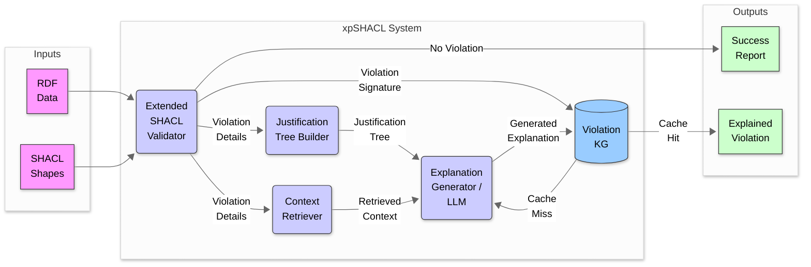
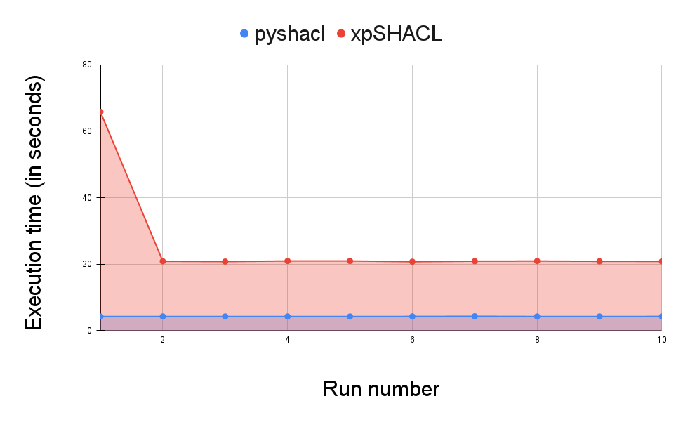

# xpSHACL: Explainable SHACL Validation

## Overview

xpSHACL is an explainable SHACL validation system designed to provide human-friendly, actionable explanations for SHACL constraint violations. Traditional SHACL validation engines often produce terse validation reports and only in English, making it difficult for users to understand why a violation occurred and how to fix it. This system addresses this issue by combining rule-based justification trees with retrieval-augmented generation (RAG) and large language models (LLMs) to produce detailed, understandable, and multi-language explanations.

A key feature of xpSHACL is its use of a **Violation Knowledge Graph (KG)**. This persistent graph stores previously encountered SHACL violation signatures along with their corresponding natural language explanations and correction suggestions. This caching mechanism enables xpSHACL to efficiently reuse previously generated explanations, significantly improving performance and consistency.

**Disclaimer:** xpSHACL is an independent project and is **not affiliated with or related to any existing projects or initiatives using the name "SHACL-X" or similar variants.** Any perceived similarities are purely coincidental.

## Architecture



## Features

* **Explainable SHACL Validation:** Captures detailed information about constraint violations beyond standard validation reports.
* **Multi language output:** Provides the explanation and suggestions to fix them in multiple languages.
* **Justification Tree Construction:** Builds logical justification trees to explain the reasoning behind each violation.
* **Violation KG:** Generates a violations Knowledge Graph, caching similar violations and their natural language explanations / correction suggestions.
* **Context Retrieval (RAG):** Retrieves relevant domain knowledge, including ontology fragments and shape documentation, to enrich explanations.
* **Natural Language Generation (LLM):** Generates human-readable explanations and correction suggestions using large language models.
* **Support to multiple LLMs:** To the moment, OpenAI, Google Gemini, and Anthropic's Claude models are supported via API. Any other models with API following the OpenAI standard can be quickly and easily extended.
* **Ollama Integration:** Enables local LLM usage for enhanced privacy and performance with lower costs.
* **Simple Interface:** Provides JSON outputs validating and explaining RDF data violations.
* **Generalizability:** The underlying methodology is adaptable to other constraint languages.

## Getting Started

### Prerequisites

* Python 3.7+
* API Keys for LLMs (OpenAI, Google, or Anthropic)
* Ollama (optional, for local LLM usage)

### Installation

1.  Clone the repository:

    ```bash
    git clone <repository_url>
    cd xpshacl
    ```

2.  Create a virtual environment (recommended):

    ```bash
    python3 -m venv .venv
    source .venv/bin/activate  # On macOS and Linux
    .venv\Scripts\activate     # On Windows
    ```

3.  Install the required dependencies:

    ```bash
    pip install -r requirements.txt
    ```

4.  Add a `.env` file to the root folder containing your API keys (this won't be committed to any repo):

    ```bash
    OPENAI_API_KEY=xxxxxxxxx
    GEMINI_API_KEY=xxxxxxxxx
    ANTHROPIC_API_KEY=xxxxxxxxx
    ```

5.  (Optional, for running locally) Install and run Ollama, and pull a model (e.g., `gemma3:4b`):

    ```bash
    ollama pull gemma3:4b
    ```
    PS: `gemma3:4b` model is recommended due to its speed and small size, while `deepseek-r1` could be used for more complex shapes.

## Usage

### Parameters

The `main.py` script accepts the following command-line parameters:

* `--data <path>`
    * **Required.** Specifies the file path to the RDF data file that needs validation.
    * Example: `--data data/example_data.ttl`
* `--shapes <path>`
    * **Required.** Specifies the file path to the SHACL shapes file to validate against.
    * Example: `--shapes data/example_shapes.ttl`
* `--input_report <path>`
    * Optional. Specifies the file path to a previously generated SHACL Violation Report in `ttl` file. 
* `--model <model_name>`
    * Optional. Specifies the identifier of the LLM model to be used via API (e.g., OpenAI, Google, Anthropic models).
    * This parameter is ignored if the `--local` flag is set.
    * If neither `--model` nor `--local` is provided, a default API model (e.g., `gpt-4o-mini-2024-07-18`) might be used.
    * Example: `--model gpt-4o-mini-2024-07-18`
* `--language <lang_code>`
    * Optional. A comma-separated list specifying the desired language for the explanations and suggestions using ISO 639-1 codes (e.g., `en,es,de,fr,cn,pt`).
    * Defaults to English (`en`) if not provided.
    * Example: `--language de`
    * **Tip**: works better with API-based models.
* `--local`
    * Optional. A flag indicating that a locally running LLM via Ollama should be used for generation.
    * If this flag is present, the `--model` parameter (for API models) is ignored. The specific Ollama model used might be configured internally or default to a predefined one (e.g., `gemma3:4b`).
    * Example: `--local`
    * **Warning**: Due to limitations of open-source models, using `--language` with `--local` (Ollama) might not produce the desired output in multiple languages as expected.

### Running the tool

1.  Place your RDF data and SHACL shapes files in the `data/` directory.

2.  Run the `main.py` script with your parameters, e.g.:

    ```bash
    python src/main.py --data data/example_data.ttl --shapes data/example_shapes.ttl --model=gpt-4o-mini-2024-07-18
    ```

    or to run with Ollama:

    ```bash
    python src/main.py --data data/example_data.ttl --shapes data/example_shapes.ttl --local --model=gemma3:4b
    ```

3.  The system will validate the RDF data and output detailed explanations for any violations in JSON format.

### Example output

```json
en: {
  "violation": "ConstraintViolation(focus_node='http://example.org/resource1', shape_id='nbcf05f9cfb1447809440b6ab69a8daf8b2', constraint_id='http://www.w3.org/ns/shacl#MinInclusiveConstraintComponent', violation_type=<ViolationType.VALUE_RANGE: 'value_range'>, property_path='http://example.org/hasAge', value='-20', message='Value is not >= Literal(\"0\", datatype=xsd:integer)', severity='Violation', context={})",
  "justification_tree": {
    "violation": {
      "focus_node": "http://example.org/resource1",
      "shape_id": "nbcf05f9cfb1447809440b6ab69a8daf8b2",
      "constraint_id": "http://www.w3.org/ns/shacl#MinInclusiveConstraintComponent",
      "violation_type": "ViolationType.VALUE_RANGE",
      "property_path": "http://example.org/hasAge",
      "value": "-20",
      "message": "Value is not >= Literal(\"0\", datatype=xsd:integer)",
      "severity": "Violation",
      "context": {}
    },
    "justification": {
      "statement": "Node <http://example.org/resource1> fails to conform to shape nbcf05f9cfb1447809440b6ab69a8daf8b2",
      "type": "conclusion",
      "evidence": null,
      "children": [
        {
          "statement": "The shape nbcf05f9cfb1447809440b6ab69a8daf8b2 has a constraint <http://www.w3.org/ns/shacl#MinInclusiveConstraintComponent>.",
          "type": "premise",
          "evidence": "From shape definition: nbcf05f9cfb1447809440b6ab69a8daf8b2",
          "children": []
        },
        {
          "statement": "The data shows that property <http://example.org/hasAge> of node <http://example.org/resource1> has value -20",
          "type": "observation",
          "evidence": "<http://example.org/resource1> <http://example.org/hasAge> \"-20\"^^<http://www.w3.org/2001/XMLSchema#integer> .\n",
          "children": []
        }
      ]
    }
  },
  "retrieved_context": "DomainContext(ontology_fragments=['<http://example.org/resource1> <http://www.w3.org/1999/02/22-rdf-syntax-ns#type> <http://example.org/Person>.', '<http://example.org/resource1> <http://example.org/hasAge> \"-20\"^^<http://www.w3.org/2001/XMLSchema#integer>.'], shape_documentation=[], similar_cases=['http://example.org/resource2'], domain_rules=[])",
  "natural_language_explanation": "The node fails to conform to the specified shape because it contains a property that has been assigned a value that is less than the minimum allowed value. The shape enforces a constraint requiring that the property must be greater than or equal to zero, but the provided value is below this threshold. This results in a violation of the minimum inclusive constraint defined for that property.",
  "correction_suggestions": [
    "1. Change the negative value of the property to a positive one to comply with the minimum value requirement.\n\n2. Alter your SHACL rule to allow for positive values, if you want to accept negative inputs.\n\n3. Ensure that the value assigned to the property is greater than or equal to the specified minimum limit. \n\n4. Review and correct the data entry to meet the defined constraints for the property."
  ],
  "provided_by_model" : "gpt-4o-mini-2024-07-18"
}
```

## Generating Synthetic Data

If you want more complex data exmaples to test xpSHACL, you can generate synthetic RDF data and SHACL shapes using the provided Python scripts.

1.  Navigate to the `data` directory:

    ```bash
    cd data
    ```

2.  Run the `synthetic_data_generator.py` script:

    ```bash
    python generate_complex_data.py
    ```

    This will generate two files: `complex_data.ttl` (the RDF data) and `complex_shapes.ttl` (the SHACL shapes).

    **`synthetic_data_generator.py` Explanation:**

    * Uses `rdflib` to create an RDF graph.
    * Generates `ex:Resource` instances with properties like `ex:integerValue`, `ex:stringValue`, `ex:dateValue`, `ex:languageValue`, and `ex:listValue`.
    * Introduces random violations to the data (e.g., invalid data types, missing properties).
    * Serializes the graph to `complex_data.ttl` in Turtle format.
    * Defines a shape `ex:ResourceShape` that targets `ex:Resource` instances.
    * Includes various types of SHACL constraints:
        * Datatype constraints (`sh:datatype`)
        * Cardinality constraints (`sh:minCount`, `sh:maxCount`)
        * String constraints (`sh:minLength`, `sh:maxLength`, `sh:pattern`)
        * Language constraints (`sh:languageIn`)
        * Node kind constraints (`sh:nodeKind`)
        * Logical constraints (`sh:AndConstraintComponent`)
        * SPARQL constraints (`sh:SPARQLConstraintComponent`)
    * Serializes the shapes graph to `complex_shapes.ttl` in Turtle format.


## Performance evaluation
  
  
  

  The chart visually compares the execution time of `xpSHACL` against the standard `pyshacl` library, which serves as the baseline. Since `xpSHACL` utilizes `pyshacl` for the core validation, the chart highlights the additional time incurred by `xpSHACL`'s explainability features, such as justification tree building, context retrieval, Violation KG interaction, and LLM-based explanation generation. A key aspect demonstrated is the impact of the Violation KG cache: scenarios where explanations are retrieved from the cache (cache hit) are significantly faster than those requiring new LLM generation (cache miss). In essence, the chart quantifies the performance overhead associated with adding these explainability layers on top of standard SHACL validation.

  Those tests can be reproduced as follows:

  1. Create `complex_data.ttl` and `complex_shapes.ttl` outuput files using the `synthetic_data_generator.py` script as described previously; inside of `data` folder, run:
  ```bash
    python generate_complex_data.py
  ```
  2. Then, in the root folder, run the loop scripts for `pyshacl` and `xpSHACL`:
  ```bash
    $ python loop_pyshacl.py -n 10
    Run #1: 4.2536452
    Run #2: 4.2741511
    Run #3: 4.2675810
    Run #4: 4.2672777
    Run #5: 4.2615638
    Run #6: 4.2812388
    Run #7: 4.3250489
    Run #8: 4.2688792
    Run #9: 4.2656274
    Run #10: 4.2828491
    $ python loop_xpshacl.py -n 10
    Run #1: 65.8021901
    Run #2: 20.8800125
    Run #3: 20.7951224
    Run #4: 20.9706643
    Run #5: 20.9720330
    Run #6: 20.7527769
    Run #7: 20.9059060
    Run #8: 20.9475248
    Run #9: 20.8706739
    Run #10: 20.8422592
  ```

  The output of runtimes also demonstrates stability for this particular scenario. The execution time is consistent, predictable, and not subject to significant random variations.
  

## Project Structure

```
xpshacl/
├── data/
│   ├── example_data.ttl
│   ├── example_shapes.ttl
│   ├── synthetic_data_generator.py
|   └── xpshacl_ontology.ttl
├── src/
│   ├── __init__.py
│   ├── context_retriever.py
│   ├── explanation_generator.py
│   ├── extended_shacl_validator.py
│   ├── justification_tree_builder.py
│   ├── main.py
│   ├── violation_kg.py
│   ├── violation_signature_factory.py
│   ├── violation_signature.py
│   └── xpshacl_architecture.py
├── tests/
│   ├── __init__.py
│   ├── test_context_retriever.py
│   ├── test_explanation_generator.py
│   ├── test_extended_shacl_validator.py
│   ├── test_justification_tree_builder.py
│   └── test_violation_kg.py
├── requirements.txt
├── README.md
├── LICENSE
```

## Run Unit Tests

1. The unit tests can be run using:

    ```bash
    python -m unittest discover tests
    ```

## Contributing

Contributions are welcome! Please feel free to submit a pull request or open an issue to discuss potential improvements.

## License

This project is licensed under the [MIT License](LICENSE).

## References

1.  d'Amato, C., De Giacomo, G., Lenzerini, M., Lepri, B., & Melchiorri, M. (2020). Explainable Al and the Semantic Web. Semantic Web, 11(1), 1-4.
2.  Gayo, J. E. D., Arias, M., & García-Castro, R. (2019). Debugging RDF data using SHACL and SPIN rules. Journal of Web Semantics, 58, 100502.
3.  Lewis, M., Liu, Y., Goyal, N., Ghazvininejad, M., Mohamed, A., Levy, O., Stoyanov, V., & Zettlemoyer, L. (2020). Retrieval-Augmented Generation for Knowledge-Intensive NLP Tasks. Advances in Neural Information Processing Systems, 33, 9459-9474.
4.  Reiter, E., & Dale, R. (2000). Building Natural Language Generation Systems. Cambridge University Press.
5.  Bouraoui, Z., & Vandenbussche, P. Y. (2019). Context-aware reasoning over knowledge graphs. In Proceedings of ESWC 2019 (pp. 1-16). Springer.
6.  Rossi, A., Krompaß, D., & Lukasiewicz, T. (2020). Explainable reasoning over knowledge
